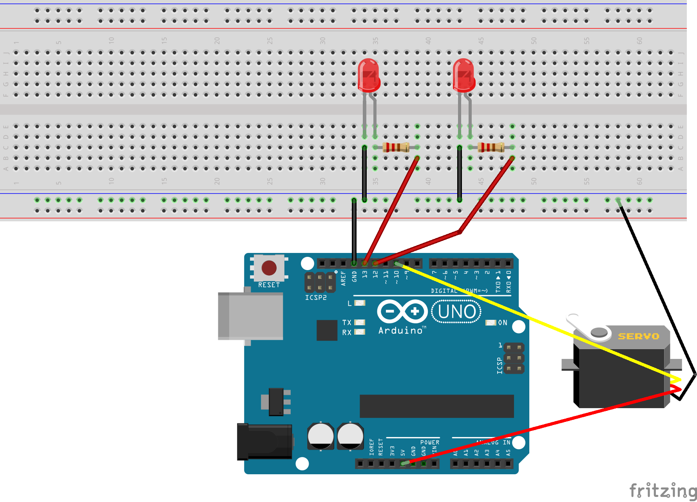
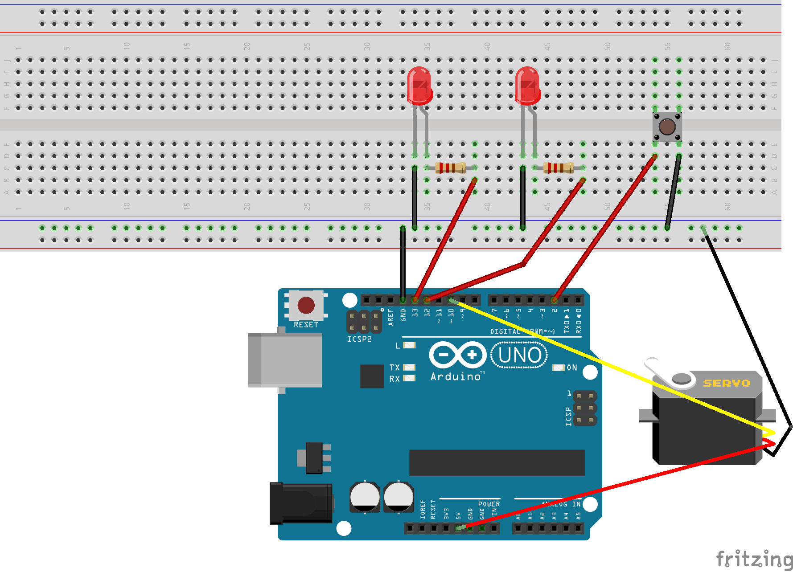
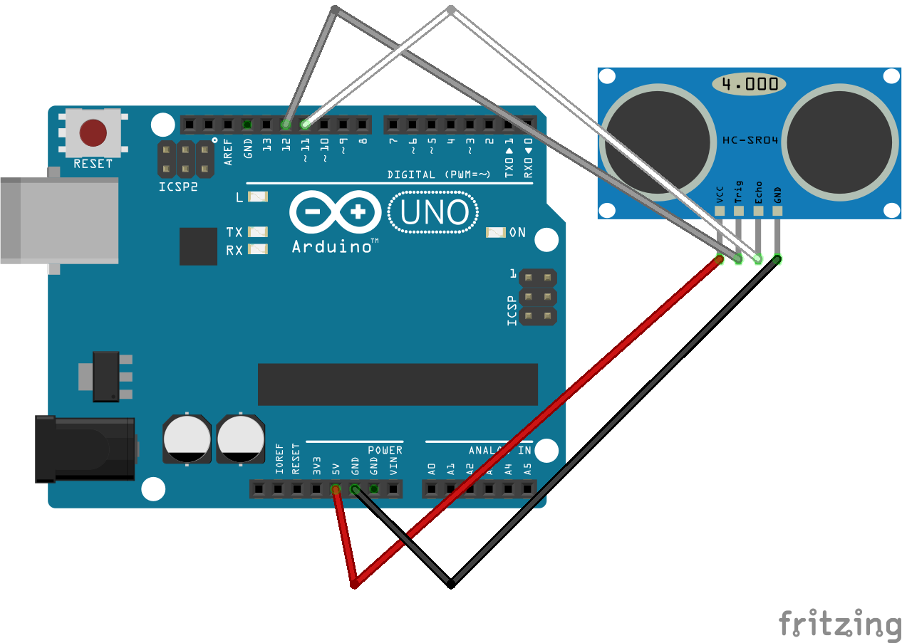
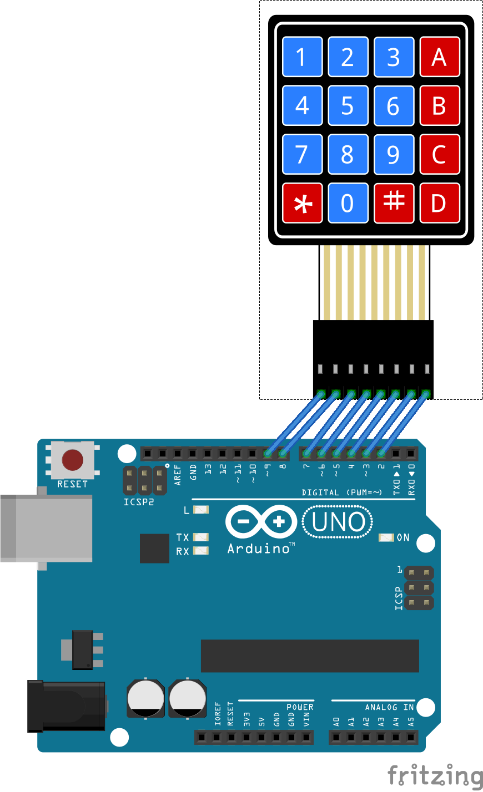

# arduino-playground

This project contains several Arduino sketches.

## simple-multi-tasking

Simple multitasking example that uses the main application loop of the arduino.
In each loop we we trigger an update request on the LEDs and the servo connected.

To compile this sketch you must install this Arduino libraries first:
- [Sweeper2 Arduino lib] (https://github.com/Eden33/arduino-lib-sweeper2)
- [Flasher2 Arduino lib] (https://github.com/Eden33/arduino-lib-flasher2)

## timer-multi-tasking-v_1_0

This sketch requires same breadboard setup than sketch timer-multi-tasking-v_1_1. The sketch uses a timer interrupt service routine to update the LEDs and the servo in a 1 millisecond interval. The servo is not updated in case the button connected to pin 2 is pressed. 

To compile this sketch you must install this Arduino libraries first:
- [Sweeper2 Arduino lib] (https://github.com/Eden33/arduino-lib-sweeper2)
- [Flasher2 Arduino lib] (https://github.com/Eden33/arduino-lib-flasher2)

## timer-multi-tasking-v_1_1

This sketch is an extended version of timer-multi-tasking-v_1_0. Instead of preventing the update of the servo a reset is executed each time the button is pressed. This behavior is triggered by an external interrupt handler registered on pin 2.

To compile this sketch you must install this Arduino libraries first:
- [Sweeper2 Arduino lib] (https://github.com/Eden33/arduino-lib-sweeper2)
- [Flasher2 Arduino lib] (https://github.com/Eden33/arduino-lib-flasher2)

## distance-measurement-v-1_0

This sketch uses an HC-SR04 to measure the distance to objects in front of it.
The distance is printed to the serial output.

## membran-keypad-v-1_0 

This sketch uses a 4x4 membran keyboard. 
It captures the key pressed and prints it to the serial output.

