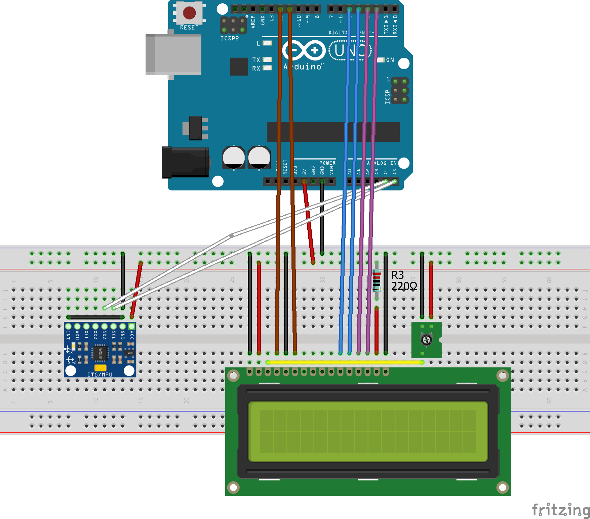
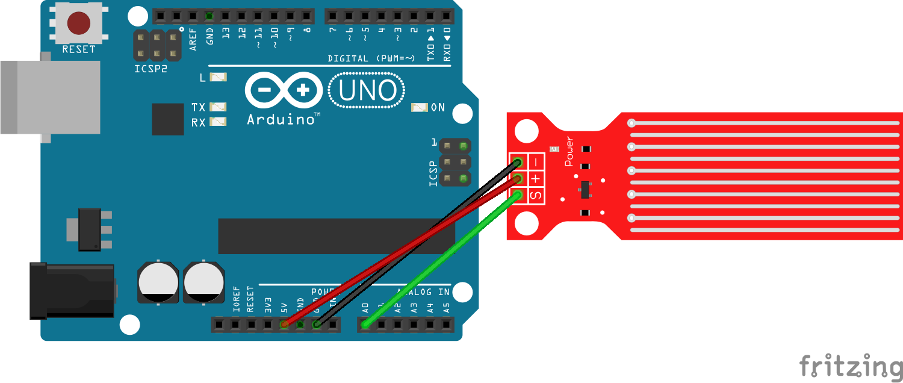
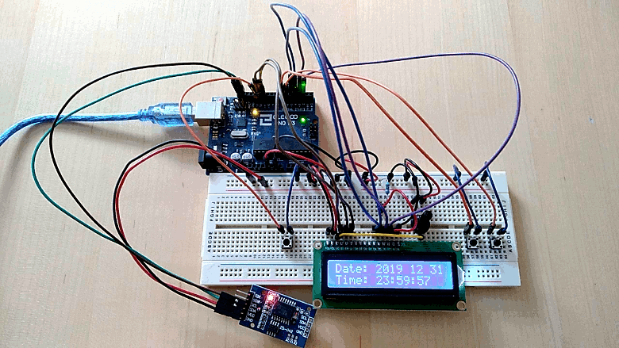
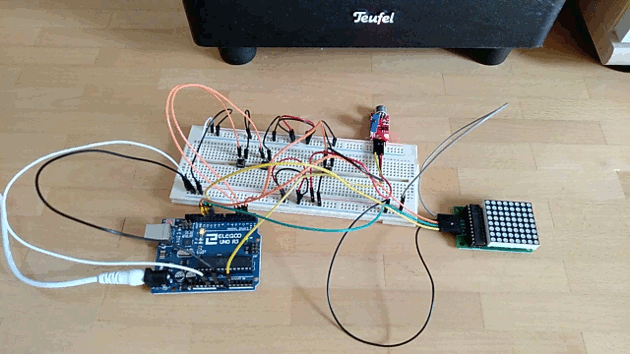
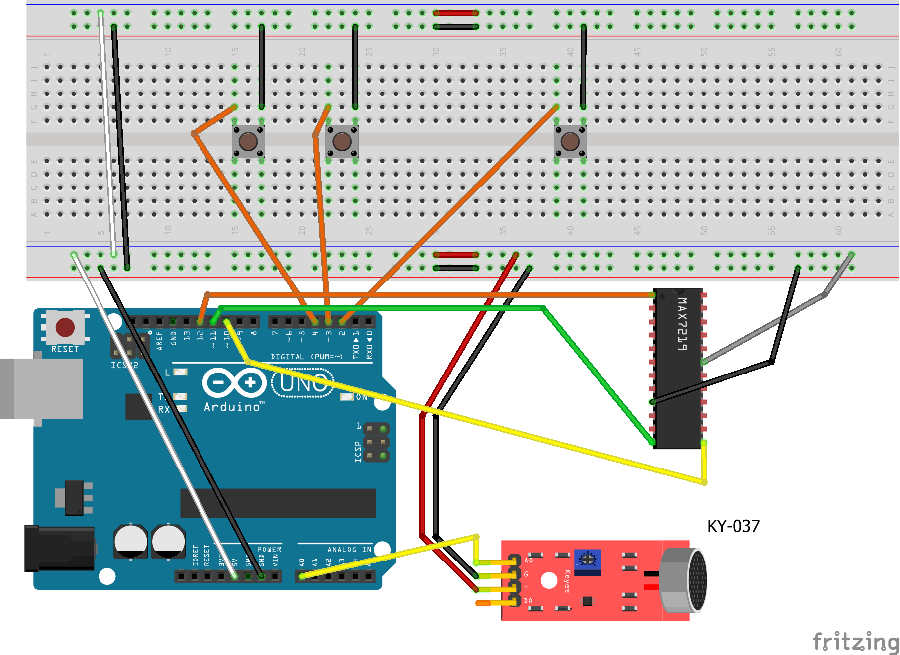
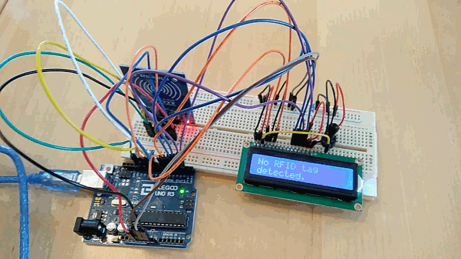
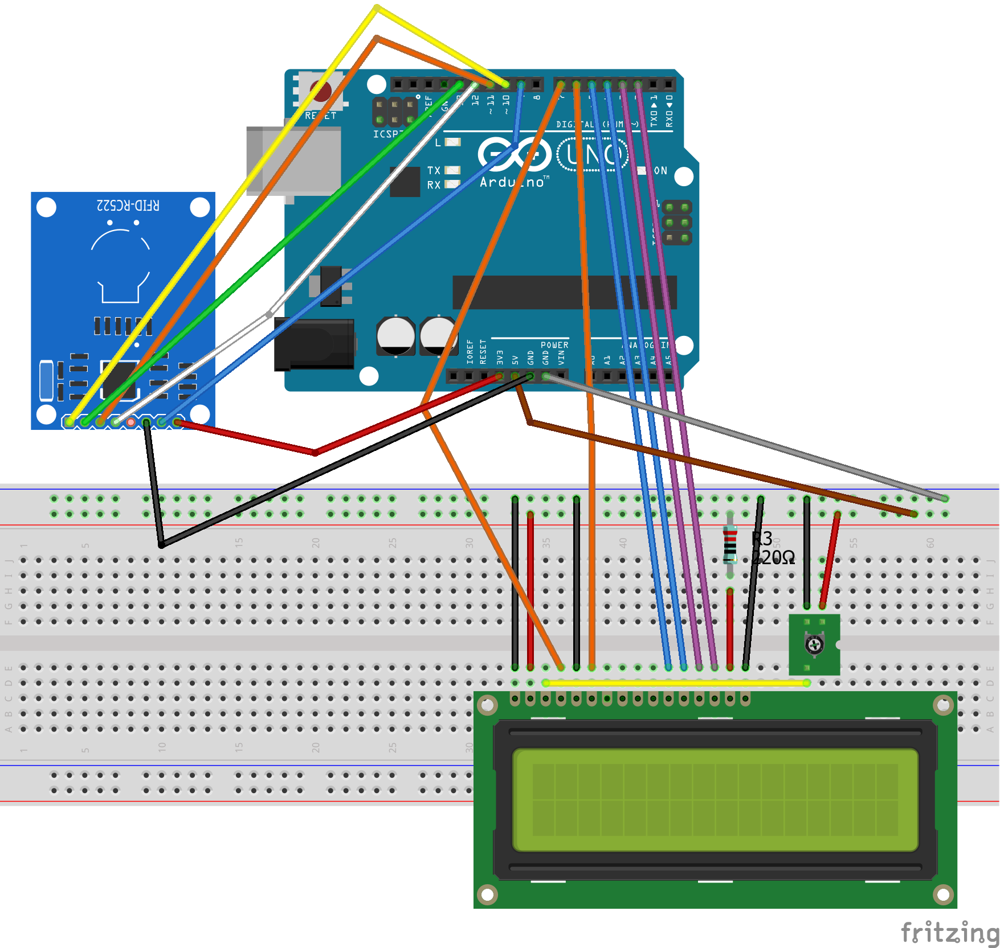

# arduino-playground

This project contains the following Arduino sketches:
* <a href="#simple-multi-tasking">simple-multi-tasking</a>
* <a href="#timer-multi-tasking-v-1_0">timer-multi-tasking-v-1_0</a>
* <a href="#timer-multi-tasking-v-1_1">timer-multi-tasking-v-1_1</a>
* <a href="#distance-measurement-v-1_0">distance-measurement-v-1_0</a>
* <a href="#membran-keypad-v-1_0">membran-keypad-v-1_0</a>
* <a href="#temperature-and-humidity-v-1_0">temperature-and-humidity-v-1_0</a>
* <a href="#temperature-and-humidity-v-2_0">temperature-and-humidity-v-2_0</a>
* <a href="#joystick-v-1_0">joystick-v-1_0</a>
* <a href="#infrared-send-receive-v-1_0">infrared-send-receive-v-1_0</a>
* <a href="#infrared-send-receive-v-1_1">infrared-send-receive-v-1_1</a>
* <a href="#led-display-8x8-v-1_0">led-display-8x8-v-1_0</a>
* <a href="#pull-up-pull-down-resistor-v-1_0">pull-up-pull-down-resistor-v-1_0</a>
* <a href="#imu-v-1_0">imu-v-1_0</a>
* <a href="#pir-v-1_0">pir-v-1_0</a>
* <a href="#water-level-sensor-v-1_0">water-level-sensor-v-1_0</a>
* <a href="#rtc-v-1_0">rtc-v-1_0</a>
* <a href="#sound-v-1_0">sound-v-1_0</a>
* <a href="#rfid-v-1_0">rfid-v-1_0</a>

## simple-multi-tasking

[Link to the code.](./simple-multi-tasking)

Simple multitasking example that uses the main application loop of the arduino.
In each loop we we trigger an update request on the LEDs and the servo connected.

To compile this sketch you must install this Arduino libraries first:
- [Sweeper2 Arduino lib] (https://github.com/Eden33/arduino-lib-sweeper2)
- [Flasher2 Arduino lib] (https://github.com/Eden33/arduino-lib-flasher2)

## timer-multi-tasking-v-1_0

[Link to the code.](./timer-multi-tasking-v-1_0)

This sketch uses a timer interrupt service routine to update the LEDs and the servo in a 1 millisecond interval. The servo is not updated in case the button connected to pin 2 is pressed. 

To compile this sketch you must install this Arduino libraries first:
- [Sweeper2 Arduino lib] (https://github.com/Eden33/arduino-lib-sweeper2)
- [Flasher2 Arduino lib] (https://github.com/Eden33/arduino-lib-flasher2)

## timer-multi-tasking-v-1_1

[Link to the code.](./timer-multi-tasking-v-1_1)

This sketch is an extended version of <a href="#timer-multi-tasking-v-1_0">timer-multi-tasking-v-1_0</a> and requires same breaboard configuration. Instead of preventing the update of the servo a reset is executed each time the button is pressed. This behavior is triggered by an external interrupt handler registered on pin 2.

To compile this sketch you must install this Arduino libraries first:
- [Sweeper2 Arduino lib] (https://github.com/Eden33/arduino-lib-sweeper2)
- [Flasher2 Arduino lib] (https://github.com/Eden33/arduino-lib-flasher2)

## distance-measurement-v-1_0

[Link to the code.](./distance-measurement-v-1_0)

This sketch uses an HC-SR04 to measure the distance to objects in front of it.
The distance is printed to the serial output.

## membran-keypad-v-1_0 

[Link to the code.](./membran-keypad-v-1_0)

This sketch uses a 4x4 membran keyboard. 
It captures the key pressed and prints it to the serial output.

## temperature-and-humidity-v-1_0

[Link to the code.](./temperature-and-humidity-v-1_0)

This sketch uses a DHT11 temperature and humidity sensor. It reads in a 2 seconds interval the temperature and humidity from the sensor and prints it to the serial output.

## temperature-and-humidity-v-2_0

[Link to the code.](./temperature-and-humidity-v-2_0)

This sketch uses a DHT11 temperature and humidity sensor + a thermistor. Each 2 seconds the latest temperature is fetched from both components and visualized using a LCD 1602 module which is also part of the breadboard configuration. The result looks like the following:

*Please note:*
The temperature "measured" by the thermistor is derived with help of the Steinhart–Hart equation. The  coefficients used in the Steinhart–Hart equation depend on the thermistor used.

## joystick-v-1_0

[Link to the code.](./joystick-v-1_0)

This sketch uses a KY-023 joystick. It demonstrates:
- How to read data from the joystick and print it to serial out.
- How to use registers to change the pin mode and write or read to/from the pins.

## infrared-send-receive-v-1_0

[Link to the code.](./infrared-send-receive-v-1_0)

This sketch decodes the NEC protocol it receives from a remote control and prints the pressed button to the serial out. The infrared receiver used is a AX-1838HS on a breakout board. To catch the NEC data we use a timer 2 interrupt in CTC mode.

## infrared-send-receive-v-1_1

[Link to the code.](./infrared-send-receive-v-1_1)

This sketch is a copy of the sketch you can find in <a href="#infrared-send-receive-v-1_0">infrared-send-receive-v-1_0</a> (= approx. 95 % of the code is the same). However, to capture the NEC data we use an external interrupt handler registered on pin 2. Each time the pin changes from HIGH to LOW or vice versa we remember the timing using the state machine.

## led-display-8x8-v-1_0

[Link to the code.](./led-display-8x8-v-1_0)

This sketch uses a MAX7219 and a 8x8 LED matrix. The LED states are pushed via SPI (Serial Peripheral Interface) to the MAX7219 who orchestrates the LEDs.

## pull-up-pull-down-resistor-v-1_0

[Link to the code.](./pull-up-pull-down-resistor-v-1_0)

Understand pull-up/pull-down resistors.

Pull down resistor:

Pull up resistor:

Pull up resistor (use build in resistor part of the pin):

## imu-v-1_0

[Link to the code.](./imu-v-1_0)

This sketch uses a GY-521 IMU device (= Inertia Measurement Unit) that ships with a gyroscope and accelerometer which are build in sensors (so called MEMS = Micro Elecrical Mechanical Systems) available on the device. The GY-521 uses a standard I2C bus for data transmission. The Arduino is a master and the GY-521 is a slave on that bus. The raw data the GY-521 returns to the Arduino is used to calculate the current orientation of the breadboard (= X- and Y-axis). Last but not least the calculated data is visualized in real time with help of a LCD 1602 module which is also part of the breadboard configuration.

## pir-v-1_0

[Link to the code.](./pir-v-1_0)

This sketch uses a HC-SR501 PIR sensor (= Passive Infrared Sensor) to detect motion. The current status is displayed on a LCD 1602 module also part of the breadboard configuration. Once the Arduino is powered on 60 seconds are granted to the PIR sensor to bootstrap its functionality (in this timeframe the sensor may output wrong results according to the data sheet; therefore we wait). After that time period "No motion." will be displayed on the LCD display in case no motion is detected. Once motion is detected "Motion detected." will be displayed on the LCD display for 3 seconds. After the 3 seconds the PIR sensor will be idle (= blocks further motion detection) for another 3 seconds which is also displayed on the LCD display indicated by a countdown. Once the idle time is over next motion can be detected.

The PIR configuration required is described with help of images you can find in the sketch.

## water-level-sensor-v-1_0

[Link to the code.](./water-level-sensor-v-1_0)

This sketch uses a water level sensor that can be used to monitor water level. The sketch is very simple. We just read the analog data from the sensor which indicates the current water level. This information is printed in a 1 second interval to serial out.

 

## rtc-v-1_0

[Link to the code.](./rtc-v-1_0)

This sketch is centered around a real time clock (= DS3231); a so called RTC. Together with the other components on the breadboard a clock device for end users is created. With the "edit button" located on left hand side of the LCD display you are able to enter the edit mode of the clock. In case you press the "edit button" the year starts blinking, in case you press the "edit button" once more the blinking is moved to the month and so on. The blinking item is adjustable with the "down"- and "up"-button located on righ hand side of the LCD display. The clock will enter normal mode again in case there is no interaction with the clock for 10 seconds ( = press button "edit button", "down" or "up"- button).

## sound-v-1_0

[Link to the code.](./sound-v-1_0)

This sketch uses the sound sensor module KY-037 to measure sound. The measured sound is visualized with help of a MAX7219 that controls a 8x8 LED matrix also part of the breadboard configuration. The 3 buttons on the breadboard can be used for configuration. The single button on the right hand side triggers recalibration of the background noise which should not be visualized. The button group on the left hand side can be used to calibrate the sensitivity of the sound level visualization on the LED matrix. The left button increases the sensitivity and the right button decreases the sensitivity each time you press the button.

## rfid-v-1_0

[Link to the code.](./rfid-v-1_0)

This sketch uses a RFID-RC522 reader module, a MIFARE Classic 1K card/tag and a LCD 1602 module. The sketch does the following:  
* Each time you scan the card the current scan counter on the card is incremented by 1 and remembered on the card EEPROM.
* The current scan counter is reset to 0 each time it exceeds 3.
* The current state of the program is visualized with help of the LCD module. The messages:
  * No RFID tag detected. -> The reader module waits for a card.
  * RFID scanned "x" times. -> The reader module read the card, incremented the counter by 1 and displays the new scan count "x".
  * Reset scan counter. -> The reader module read the card, incremented the counter by 1 and reset the scan counter to 0 because the new value would exceed 3.
  * Error messages (e.g. in case RFID auth, read or write failed).

