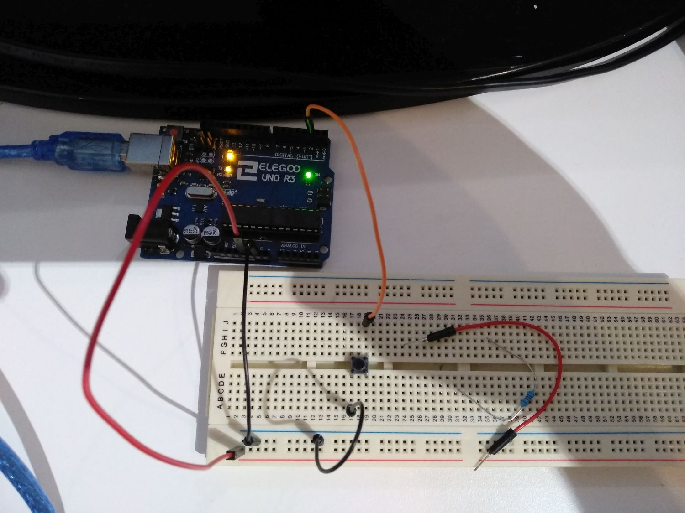

# arduino-playground

This project contains the following Arduino sketches:
* <a href="#simple-multi-tasking">simple-multi-tasking</a>
* <a href="#timer-multi-tasking-v-1_0">timer-multi-tasking-v-1_0</a>
* <a href="#timer-multi-tasking-v-1_1">timer-multi-tasking-v-1_1</a>
* <a href="#distance-measurement-v-1_0">distance-measurement-v-1_0</a>
* <a href="#membran-keypad-v-1_0">membran-keypad-v-1_0</a>
* <a href="#temperature-and-humidity-v-1_0">temperature-and-humidity-v-1_0</a>
* <a href="#joystick-v-1_0">joystick-v-1_0</a>
* <a href="#infrared-send-receive-v-1_0">infrared-send-receive-v-1_0</a>
* <a href="#infrared-send-receive-v-1_1">infrared-send-receive-v-1_1</a>
* <a href="#led-display-8x8-v-1_0">led-display-8x8-v-1_0</a>
* <a href="#pull-up-pull-down-resistor-v-1_0">pull-up-pull-down-resistor-v-1_0</a>

## simple-multi-tasking

[Link to the code.](./simple-multi-tasking)

Simple multitasking example that uses the main application loop of the arduino.
In each loop we we trigger an update request on the LEDs and the servo connected.

To compile this sketch you must install this Arduino libraries first:
- [Sweeper2 Arduino lib] (https://github.com/Eden33/arduino-lib-sweeper2)
- [Flasher2 Arduino lib] (https://github.com/Eden33/arduino-lib-flasher2)

## timer-multi-tasking-v-1_0

[Link to the code.](./timer-multi-tasking-v-1_0)

This sketch requires same breadboard setup than sketch timer-multi-tasking-v_1_1. The sketch uses a timer interrupt service routine to update the LEDs and the servo in a 1 millisecond interval. The servo is not updated in case the button connected to pin 2 is pressed. 

To compile this sketch you must install this Arduino libraries first:
- [Sweeper2 Arduino lib] (https://github.com/Eden33/arduino-lib-sweeper2)
- [Flasher2 Arduino lib] (https://github.com/Eden33/arduino-lib-flasher2)

## timer-multi-tasking-v-1_1

[Link to the code.](./timer-multi-tasking-v-1_1)

This sketch is an extended version of timer-multi-tasking-v_1_0. Instead of preventing the update of the servo a reset is executed each time the button is pressed. This behavior is triggered by an external interrupt handler registered on pin 2.

To compile this sketch you must install this Arduino libraries first:
- [Sweeper2 Arduino lib] (https://github.com/Eden33/arduino-lib-sweeper2)
- [Flasher2 Arduino lib] (https://github.com/Eden33/arduino-lib-flasher2)

## distance-measurement-v-1_0

[Link to the code.](./distance-measurement-v-1_0)

This sketch uses an HC-SR04 to measure the distance to objects in front of it.
The distance is printed to the serial output.

## membran-keypad-v-1_0 

[Link to the code.](./membran-keypad-v-1_0)

This sketch uses a 4x4 membran keyboard. 
It captures the key pressed and prints it to the serial output.

## temperature-and-humidity-v-1_0

[Link to the code.](./temperature-and-humidity-v-1_0)

This sketch uses a DHT11 temperature and humidity sensor. It reads in a 2 seconds interval the temperature and humidity from the sensor and prints it to the serial output.

## joystick-v-1_0

[Link to the code.](./joystick-v-1_0)

This sketch uses a KY-023 joystick. It demonstrates:
- How to read data from the joystick and print it to serial out.
- How to use registers to change the pin mode and write or read to/from the pins.

## infrared-send-receive-v-1_0

[Link to the code.](./infrared-send-receive-v-1_0)

This sketch decodes the NEC protocol it receives from a remote control and prints the pressed button to the serial out. The infrared receiver used is a AX-1838HS on a breakout board. To catch the NEC data we use a timer 2 interrupt in CTC mode.

## infrared-send-receive-v-1_1

[Link to the code.](./infrared-send-receive-v-1_1)

This sketch is a copy of the sketch you can find in infrared-send-receive-v-1_0 (= approx. 95 % of the code is the same). However, to capture the NEC data we use an external interrupt handler registered on pin 2. Each time the pin changes from HIGH to LOW or vice versa we remember the timing using the state machine.

## led-display-8x8-v-1_0

[Link to the code.](./led-display-8x8-v-1_0)

This sketch uses a MAX7219 and a 8x8 LED matrix. The LED states are pushed via SPI (Serial Peripheral Interface) to the MAX7219 who orchestrates the LEDs.

## pull-up-pull-down-resistor-v-1_0

[Link to the code.](./pull-up-pull-down-resistor-v-1_0)

Understand pull-up/pull-down resistors.

Pull down resistor:

Pull up resistor:

Pull up resistor (use build in resistor part of the pin):

